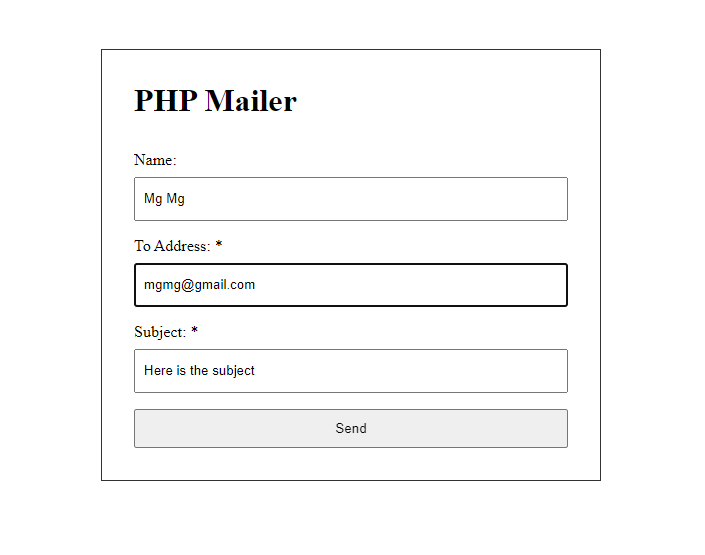

# PHP Mailer

Preview



## Installation

Install PHP dependencies:
```
php artisan init
```

Configure mail:
```
MAIL_HOST="smtp.gmail.com"
MAIL_PORT="587"
MAIL_USERNAME="My Project"
MAIL_PASSWORD="secret"
MAIL_ENCRYPTION="tls"
MAIL_FROM_ADDRESS="hello@example.com"
```

Start server:
```
php artisan serve
```

## Usage

### PHP Mailer Template

You can edit template where in `phpmailer/phpmailer_template.php`.

```
Your name is: <?php echo $name; ?>
Your email is: <?php echo $to; ?>
```
